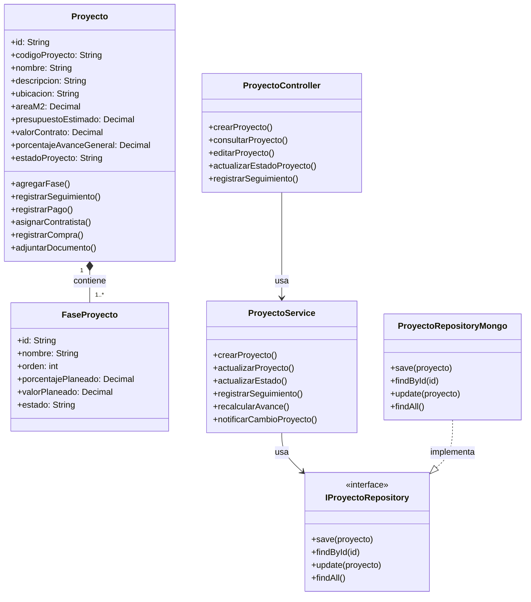
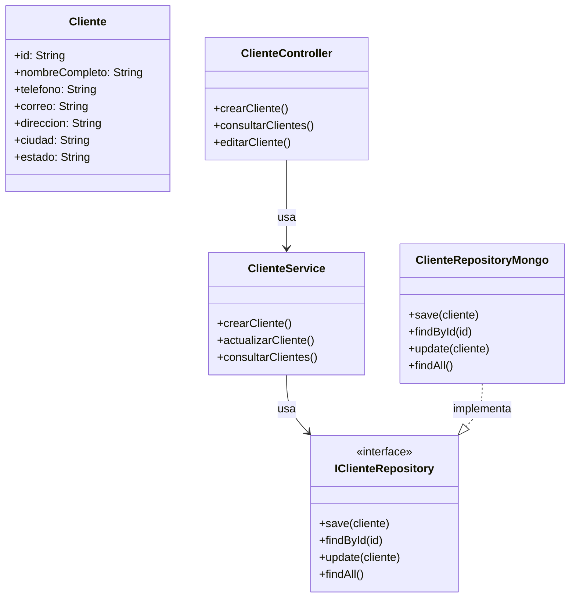
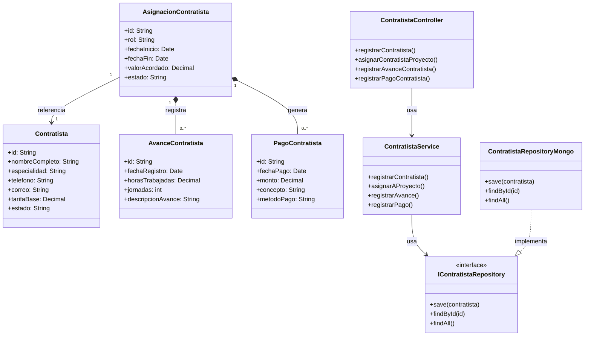
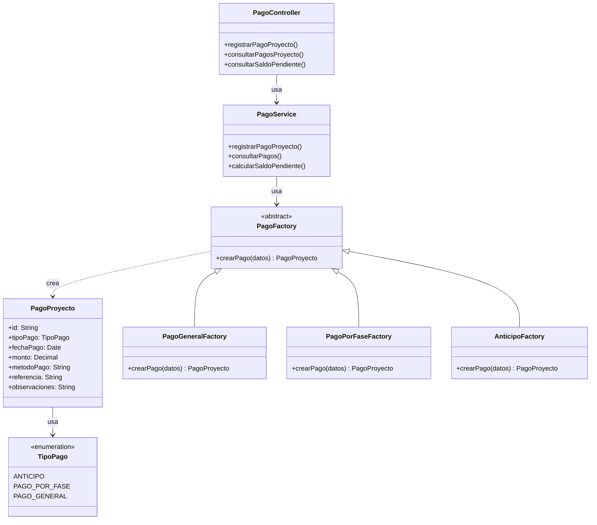
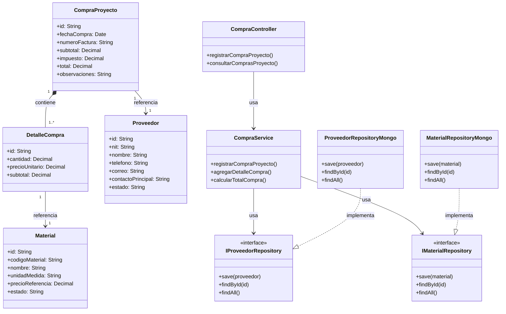
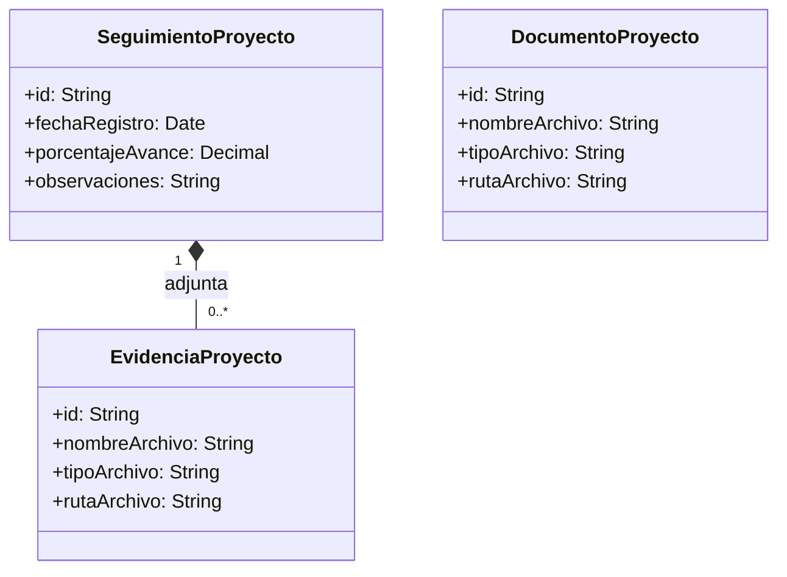
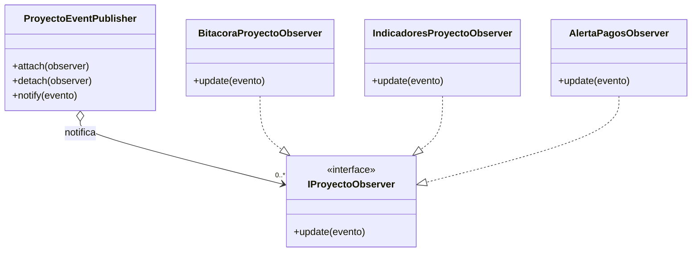
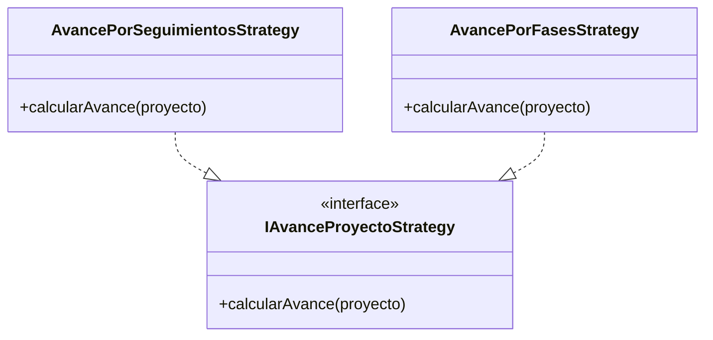
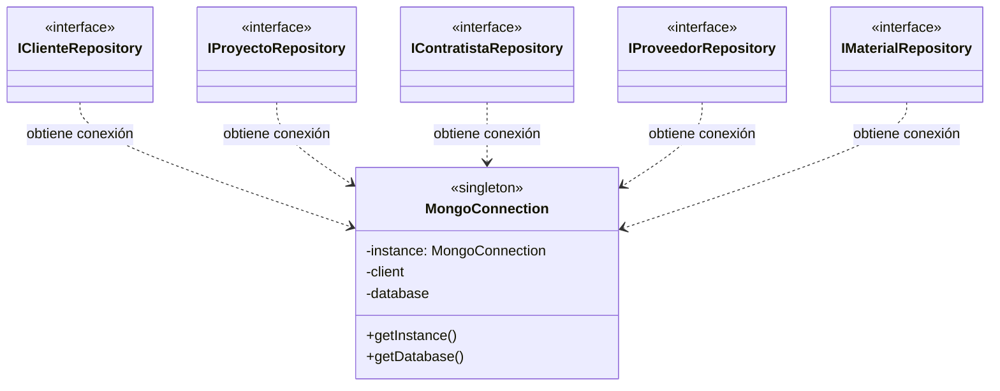
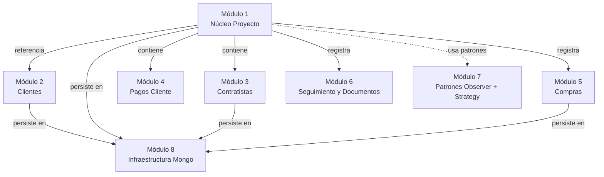

# Diagrama de Clases — Vista Modular

> División del diagrama técnico monolítico en módulos por dominio funcional, más un diagrama dedicado a los patrones de diseño transversales. Cada módulo incluye sus entidades, controladores, servicios e interfaces de repositorio relevantes.

---

## Índice

1. [Módulo 1 — Núcleo del Proyecto](#módulo-1--núcleo-del-proyecto)
2. [Módulo 2 — Gestión de Clientes](#módulo-2--gestión-de-clientes)
3. [Módulo 3 — Contratistas y Asignaciones](#módulo-3--contratistas-y-asignaciones)
4. [Módulo 4 — Pagos del Cliente](#módulo-4--pagos-del-cliente)
5. [Módulo 5 — Compras, Proveedores y Materiales](#módulo-5--compras-proveedores-y-materiales)
6. [Módulo 6 — Seguimiento y Documentos](#módulo-6--seguimiento-y-documentos)
7. [Módulo 7 — Patrones de Diseño (Observer + Strategy)](#módulo-7--patrones-de-diseño-observer--strategy)
8. [Módulo 8 — Infraestructura](#módulo-8--infraestructura)
9. [Mapa general de dependencias entre módulos](#mapa-general-de-dependencias-entre-módulos)

---

## Módulo 1 — Núcleo del Proyecto

Entidad raíz del sistema. Aquí vive `Proyecto` con sus fases y la trinidad Controller → Service → Repository que orquesta las operaciones principales.

---

## Módulo 2 — Gestión de Clientes

Subsistema autónomo para administrar la cartera de clientes. Es referenciado por `Proyecto` (un cliente tiene 1..N proyectos).

> **Relación con Núcleo:** `Proyecto` referencia a `Cliente` mediante `clienteId` (cardinalidad `1..* → 1`).

---

## Módulo 3 — Contratistas y Asignaciones

Gestiona la red de contratistas, su asignación a proyectos, los avances de obra registrados y los pagos por jornadas o concepto.

> **Relación con Núcleo:** `Proyecto` contiene `0..*` `AsignacionContratista`.

---

## Módulo 4 — Pagos del Cliente

Subsistema de cobros con **patrón Factory Method** para crear distintos tipos de pago (anticipo, por fase o general).

> **Relación con Núcleo:** `Proyecto` contiene `0..*` `PagoProyecto`. El servicio delega la creación a la factory correspondiente según `TipoPago`.

---

## Módulo 5 — Compras, Proveedores y Materiales

Maneja las compras de insumos, su detalle por material y el catálogo de proveedores.

> **Relación con Núcleo:** `Proyecto` registra `0..*` `CompraProyecto`.

---

## Módulo 6 — Seguimiento y Documentos

Bitácora operativa: cada `SeguimientoProyecto` puede llevar evidencias adjuntas, y el proyecto almacena documentos generales.

> **Relaciones con Núcleo:**
> - `Proyecto` registra `0..*` `SeguimientoProyecto`.
> - `Proyecto` almacena `0..*` `DocumentoProyecto`.

---

## Módulo 7 — Patrones de Diseño (Observer + Strategy)

Patrones transversales que desacoplan al `Proyecto` de sus reacciones a eventos y de la lógica de cálculo de avance.

### 7.1 Observer — Notificación de eventos del proyecto

### 7.2 Strategy — Cálculo de avance

> **Relación con Núcleo:**
> - `ProyectoService` publica eventos a través de `ProyectoEventPublisher`.
> - `ProyectoService.recalcularAvance()` delega en una `IAvanceProyectoStrategy` configurable.

---

## Módulo 8 — Infraestructura

Conexión única a MongoDB compartida por todos los repositorios. Aplica el **patrón Singleton**.

---

## Mapa general de dependencias entre módulos

Vista de alto nivel para entender cómo se conectan los módulos sin entrar en clases individuales.

---

## Notas de lectura

- **Cardinalidades:** se conservan las del diagrama original (`1`, `1..*`, `0..*`).
- **Estereotipos:** `<<interface>>`, `<<abstract>>`, `<<singleton>>`, `<<enumeration>>`.
- **Tipos de relación:**
  - `*--` composición fuerte (el contenedor controla el ciclo de vida).
  - `o--` agregación (referencia sin propiedad del ciclo de vida).
  - `-->` asociación / uso.
  - `..>` dependencia.
  - `..|>` realización de interfaz.
  - `<|--` herencia.
